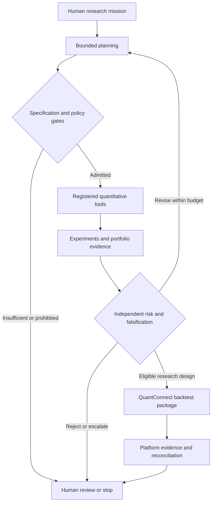

# AIAT · Autonomous Algorithmic Trading

### From first principles to notebooks, QuantConnect, and governed AI assistants

**Alejandro Reynoso**

An open research and teaching project on the architecture of autonomous quantitative systems.

[](LICENSE)
[](#scope-and-current-implementation-status)

**How do we turn an investment research question into a reproducible, testable, auditable process that an autonomous system can carry forward?**

This repository documents that journey. It brings together a foundational book, three implementation papers, an executable notebook collection, a QuantConnect/LEAN project, and an assistant implementation bundle. Together, they explain how market data, machine learning, trading strategies, portfolio construction, execution, independent risk, agents, and large language models fit into one governed architecture.

The central object is an **autonomous quantitative research institution**: a system that can interpret a bounded mission, discover approved capabilities, construct a plan, run quantitative experiments, challenge results, preserve evidence, and return consequential decisions to an accountable human.

> **The LLM proposes and interprets. Quantitative tools calculate. Independent risk challenges. Governance constrains. Humans decide.**

[The journey](#the-journey) · [Four essential texts](#four-essential-texts) · [Notebook guide](#the-notebook-collection) · [QuantConnect](#the-quantconnect-bridge) · [Assistant](#from-notebooks-to-an-invokable-assistant) · [Getting started](#choose-your-starting-point) · [License](#license-copyright-and-ai-disclosure)

## The journey

The project began with an ambitious engineering question: what would it take to build an autonomous algorithmic trading system from the ground up? The initial decomposition produced **more than 400 tasks**. That inventory exposed the true breadth of the problem: forecasting was only one part of a much larger system of data, decisions, controls, execution, and accountability.

The work then moved through successive forms, each making the architecture easier to understand, reproduce, and use.

| Stage | Transformation | What it contributed |
|---|---|---|
| **1. Define the institution** | A broad objective became an inventory of more than 400 engineering tasks. | An explicit account of the capabilities and controls the system would need. |
| **2. Organize the build** | The task inventory became a ten-day execution program, engineering diary, and installation-oriented implementation. | A manageable sequence with documented work and concrete deliverables. |
| **3. Make the method executable** | The engineering process became the NB00–NB10 notebook curriculum, including NB00A and NB00B. | A pedagogical laboratory in which readers can inspect code, assumptions, contracts, and evidence. |
| **4. Bridge research and platform execution** | The research architecture became a governed specification compiled into QuantConnect/LEAN code. | A traceable translation from notebook research to event-driven backtesting. |
| **5. Make the discipline invokable** | The notebook methodology became an assistant specification, installation package, and runtime scaffold. | A mission-oriented interface that preserves the methodology through states, artifacts, tools, and gates. |

The compression is organizational: each stage makes the work easier to navigate while retaining the underlying discipline. The book explains the architecture, the notebooks expose its mechanics, the QuantConnect bridge translates its semantics, and the assistant package encodes how the process should be invoked and governed.

## Four essential texts

Read these as four complementary views of the same project.

### 1 · The conceptual foundation

**[The course book](1_COURSE_BOOK_AUTONOMOUS_ALGO_TRADING.pdf)**

*What must an autonomous financial research system contain, and why?*

Provides the complete conceptual and methodological overview. Its **THINK → BUILD → USE AND IMPROVE** structure connects the architecture, the ten-day engineering record, and installation and extension. It preserves traditional quantitative finance while placing models inside a wider system of tools, skills, agents, control, and accountability.

### 2 · The executable methodology

**[The notebook implementation monograph](2_COLAB%20NOTEBOOKS%20AUTONOMOUS%20ALGO%20TRADING.pdf)**

*How is that architecture constructed step by step?*

Explains the objectives, methods, and contribution of the notebook sequence. It follows the progression from protocol and synthetic data to models, execution, risk, reusable capabilities, orchestration, integrated research, bounded LLM participation, and falsification.

### 3 · The research-to-platform bridge

**[The QuantConnect implementation paper](3_QUANTCONNECT%20IMPLEMENTATION%20AUTONOMOUS%20ALGO%20TRADING.pdf)**

*How does a governed research design become an event-driven LEAN algorithm?*

Analyzes NB07 in depth, including the strategy contract, deterministic compilation, five-model competition, features, portfolio construction, independent risk, corporate actions, costs, scheduling, provenance, and reconciliation. It gives QuantConnect users a direct route into the algorithm without requiring them to reproduce the entire curriculum.

### 4 · The invokable institution

**[The autonomous assistant paper](4_AUTONOMOUS%20ASSISTANT%20ALGO%20TRADING.pdf)**

*How can the discipline of the notebooks be preserved inside an assistant?*

Extracts the irreducible methodology into a canonical prompt, state machine, typed artifacts, registered tools, validators, bounded LLM reasoning, and audit closure. Includes a concrete mission example and a detailed ChatGPT installation appendix, alongside the distinction between a conversational installation and an executable software agent.

## Repository map

| Location | Contents |
|---|---|
| Four numbered PDFs at the repository root | The book and three companion papers described above. |
| [colab_notebooks/](colab_notebooks/) | 13 curriculum notebooks and an HTML flowchart for NB08. |
| [quantconnect_code/](quantconnect_code/) | The generated LEAN algorithm, compiled configuration, research notebook, specification, validation, reconciliation, and audit artifacts. |
| [autonomous_agent/](autonomous_agent/) | ChatGPT installation instructions, canonical specification, Python runtime scaffold, bridge contract, acceptance tests, and documentation. |

## The notebook collection

The numbering records the project's evolution. The current collection contains **13 notebooks**: NB00, NB00A, NB00B, and NB01 through NB10.

For the main learning path, begin with **NB00A → NB00 → NB00B**, continue through **NB01–NB06**, then study **NB08–NB10**. Read **NB07 as the separate implementation bridge** once the research architecture is understood. This keeps platform engineering from interrupting the pedagogical progression toward integrated autonomy.

| Notebook | Focus | Contribution to the system |
|---|---|---|
| [NB00A](colab_notebooks/NB00A_Autonomous_Systems_Protocol_github.ipynb) | Autonomous Systems Protocol | Defines the constitution: schemas, permissions, evidence, provenance, registries, and authority boundaries. |
| [NB00](colab_notebooks/NB00_Synthetic_Equity_Market_Engine_github.ipynb) | Synthetic Equity Market Engine | Creates the controlled market substrate, including regimes, sectors, data defects, corporate actions, and reproducibility. |
| [NB00B](colab_notebooks/NB00B_Minimal_KNN_Vertical_Slice_github.ipynb) | Minimal KNN Vertical Slice | Demonstrates the complete path from data and chronological validation to predictions, positions, costs, stress, and audit. |
| [NB01](colab_notebooks/NB01_Model_Strategy_portfolio_Lab_github.ipynb) | Model, Strategy, and Portfolio Laboratory | Compares heterogeneous models and trading rules, then examines how alternative portfolio methods change the outcome. |
| [NB02](colab_notebooks/NB02_Execution_Risk_Governance_Audit_github.ipynb) | Execution, Risk, Governance, and Audit | Adds simulated orders and fills, reconciliation, implementation frictions, stress, independent risk, and decision gates. |
| [NB03](colab_notebooks/NB03_Tool_Skill_Agent_Factory_github.ipynb) | Tool, Skill, and Agent Factory | Packages analytical operations as declared tools, repeatable skills, and bounded agent roles. |
| [NB04](colab_notebooks/NB04_Governed_Agent_Constellations_github.ipynb) | Governed Agent Constellations | Organizes specialist roles into research, strategy, portfolio, and risk-governance teams with explicit handoffs and shared-state ownership. |
| [NB05](colab_notebooks/NB05_Governed_Meta_Agent_github.ipynb) | Governed Meta-Agent | Introduces mission decomposition, capability discovery, routing, budgets, escalation, and orchestration. |
| [NB06](colab_notebooks/NB06_Autonomous_System_Release_Candidate_github.ipynb) | Autonomous System Release Candidate | Implements a closed mission loop with dynamic planning, state transitions, monitoring, recovery, and audit closure. |
| [NB08](colab_notebooks/NB08_Integrated_Autonomous_Quantitative_Research_System_github.ipynb) | Integrated Autonomous Quantitative Research | Reconnects actual model execution, strategy and portfolio comparisons, stress, and independent risk to dynamic deterministic orchestration. |
| [NB09](colab_notebooks/NB09_LLM_Governed_Autonomous_Quantitative_Research_System_github.ipynb) | LLM-Governed Autonomous Research | Adds genuine LLM planning and evidence critique while deterministic code validates and executes approved proposals. |
| [NB10](colab_notebooks/NB10_Capstone_%20github.ipynb) | Capstone Research Institution | Rejoins the canonical data contract with integrated research and LLM participation, adding stress and adversarial falsification. |
| [NB07](colab_notebooks/NB07_QuantConnect_LEAN_Governed_Implementation_Bridge_github.ipynb) | QuantConnect/LEAN Implementation Bridge | Translates a governed research specification into a platform backtest project with explicit execution semantics and retained controls. |

The notebooks are executable teaching artifacts. Several embed their inputs or reconstruct a controlled environment so that they can be studied independently. **Self-contained does not mean identical data:** NB08/NB09 use a separate synthetic fixture, while NB10 seeks the canonical database and labels a contract-compatible reconstruction when the original is unavailable. Preserve the dataset manifest and provenance when comparing results.

NB10's statement that NB07 is deferred refers to its own integration boundary. The repository now includes the separate NB07 bridge; this does not mean NB10 automatically executes or reconciles a QuantConnect run.

The [NB08 detailed flowchart](colab_notebooks/NB08_Detailed_Flowchart_Colab.html) provides an additional workflow guide. Download it and open it in a browser to view the HTML.

## The architecture that survives every transformation

Autonomy grows from the composition of capabilities under explicit controls. The language model participates in the research process through proposals and interpretation; the numerical evidence comes from executed quantitative tools.



Provenance and audit accompany the process. Each meaningful result should identify its inputs, assumptions, configuration, producing capability, validation status, and unresolved limitations.

The recurring principles are:

- **Point-in-time evidence:** features and decisions must respect what was knowable at the decision time.
- **Comparable experiments:** models, strategies, and portfolios require declared evaluation rules and chronological discipline.
- **Separation of duties:** a strategy proposal does not approve itself or override independent risk.
- **Bounded authority:** a planner selects registered capabilities within mission scope, permissions, and resource budgets.
- **Falsification:** missing evidence, failed stress tests, invalid schemas, and broken provenance must affect the outcome.
- **Traceable implementation:** generated code must retain a documented relationship to the research contract.
- **Human accountability:** research completion, platform execution, and permission to deploy are separate decisions.

## The QuantConnect bridge

Start with [README_QUANTCONNECT.md](quantconnect_code/README_QUANTCONNECT.md).

NB07 applies **semantic compilation**: it translates the meaning of a research design into a different computational environment. A notebook typically operates over tables and completed histories. LEAN advances through market events, scheduled training, portfolio changes, orders, fills, and corporate actions. Preserving the method requires explicit treatment of these differences.

The included reference algorithm uses a static teaching universe of **30 U.S. equities across six sectors**, nine trailing market features, and five competing model families: logistic regression, KNN, random forest, multilayer perceptron, and linear regression. Monthly retraining selects a champion by chronological validation balanced accuracy with a deterministic tie-break. Cross-sectional scores produce long/short proposals, inverse-volatility weighting constructs preliminary exposures, and independent risk constrains the result.

| Artifact | Role |
|---|---|
| [main.py](quantconnect_code/main.py) | Event-driven LEAN algorithm, including training, portfolio construction, risk, and audit behavior. |
| [strategy_config.py](quantconnect_code/strategy_config.py) | Compiled universe, dates, features, model families, schedules, costs, and risk limits. |
| [strategy_spec.json](quantconnect_code/strategy_spec.json) | Machine-readable research and implementation contract. |
| [validation_report.json](quantconnect_code/validation_report.json) | Recorded local checks and explicit platform verification status. |
| [reconciliation_contract.json](quantconnect_code/reconciliation_contract.json) | Contract for examining research-to-platform differences. |
| [experiment_registry.json](quantconnect_code/experiment_registry.json) and [audit_bundle.json](quantconnect_code/audit_bundle.json) | Experiment identity and supporting provenance. |
| [research.ipynb](quantconnect_code/research.ipynb) | The accompanying pedagogical bridge notebook. |

To reproduce the supplied installation route, create a Python project in QuantConnect, copy `main.py` and `strategy_config.py` into it, optionally add `research.ipynb`, and run a **backtest**. Review the platform output against the specification, risk controls, and audit evidence.

**Recorded status:** local checks are marked passed; platform compilation and platform backtesting are both `NOT_RUN` in the supplied validation report. The generated algorithm explicitly denies live mode. The repository therefore provides a research implementation awaiting platform evidence, without claiming an observed QuantConnect performance result.

## From notebooks to an invokable assistant

Start with [README_FIRST.md](autonomous_agent/README_FIRST.md) and the [assistant paper](4_AUTONOMOUS%20ASSISTANT%20ALGO%20TRADING.pdf).

The final transformation is a **reduced-form representation of the research discipline**. A user states a mission; the assistant identifies the current state, the required artifacts, the available tools, and the next permissible transition. The notebook methodology becomes a reusable operating specification.

| Component | Entry point |
|---|---|
| ChatGPT installation | [Installation guide](autonomous_agent/01_CHATGPT_INSTALLATION/INSTALL_CHATGPT.md), [Project instructions](autonomous_agent/01_CHATGPT_INSTALLATION/CANONICAL_PROJECT_INSTRUCTIONS.txt), and [upload manifest](autonomous_agent/01_CHATGPT_INSTALLATION/CHATGPT_UPLOAD_MANIFEST.json). |
| Canonical methodology | [System prompt](autonomous_agent/02_CANONICAL_SPECIFICATION/CANONICAL_SYSTEM_PROMPT.txt) and [agent specification](autonomous_agent/02_CANONICAL_SPECIFICATION/AGENT_SPECIFICATION.md). |
| Executable foundation | [Python runtime](autonomous_agent/03_PYTHON_RUNTIME/), including state, artifact, registry, audit, and LLM interfaces. |
| Platform handoff | [QuantConnect bridge](autonomous_agent/04_QUANTCONNECT_BRIDGE/) and research-to-LEAN manifest template. |
| Knowledge organization | [Knowledge manifest](autonomous_agent/05_KNOWLEDGE_FILES/KNOWLEDGE_MANIFEST.md). |
| First-use validation | [Acceptance tests](autonomous_agent/06_VALIDATION_AND_TESTS/CHATGPT_ACCEPTANCE_TESTS.md) and [first-use script](autonomous_agent/06_VALIDATION_AND_TESTS/FIRST_USE_SCRIPT.md). |
| Supporting documents | [Documentation folder](autonomous_agent/07_DOCUMENTATION/), including the paper, infographic, and LaTeX bundle. |

The canonical specification maps states **S0–S11** to mission admission, governance, data, features and partitions, experiments, strategies, portfolios, backtest evidence, independent risk, critique/replanning, LEAN packaging, and reconciliation/audit closure.

There are two distinct installation layers:

1. **ChatGPT assistant:** Project instructions and uploaded knowledge establish the conversational workflow. Acceptance tests check whether it preserves the methodology, identifies missing evidence, and refuses bypass requests. Uploading files does not automatically install or execute the Python tools.
2. **Python runtime:** code provides the foundation for enforcing workflow controls. The supplied registry still contains placeholder quantitative handlers, and the CLI uses `NullLLM`. Validated notebook functions and an operational LLM adapter must be connected before claiming an end-to-end empirical agent.

An illustrative first mission is:

```text
AIAT mission:
Objective: Compare a 20-day momentum rule with approved predictive models.
Universe: The governed synthetic-equity teaching universe.
Research period: Use the supplied dataset and declare chronological partitions.
Prediction horizon: Specify and validate before running experiments.
Rebalance: Monthly.
Constraints: Preserve independent risk, transaction costs, and audit evidence.
Required output: Research assessment; QuantConnect package only after valid gates.
Live authority: None.

First identify the current state, available evidence, missing artifacts,
and the next permissible transition. Do not invent empirical results.
```

## Choose your starting point

| Your objective | Suggested route |
|---|---|
| Understand the intellectual framework | Read the course book, then the notebook monograph. |
| Learn by executing the methodology | Follow the notebook learning order above; inspect the evidence at each stage. |
| Understand the QuantConnect algorithm | Read the dedicated implementation paper and the QuantConnect package guide. |
| Install the conversational assistant | Read the assistant paper's installation appendix, follow the upload manifest, and run acceptance tests. |
| Develop the software agent | Inspect the canonical specification and runtime; replace placeholder handlers with validated capabilities. |

Clone the repository to obtain all accompanying material:

```bash
git clone https://github.com/alexdibol/ai_at_2027.git
cd ai_at_2027
```

For Colab, open a notebook from the repository using Colab's GitHub import and follow its setup cells. NB09 and NB10 contain actual LLM calls: their setup uses `OPENAI_API_KEY` and a configurable `OPENAI_MODEL`. Check those cells before execution and supply credentials through the prescribed secret mechanism.

For the standalone runtime scaffold, use Python 3.10 or newer in an isolated environment:

```bash
cd autonomous_agent/03_PYTHON_RUNTIME
python -m venv .venv
# Activate .venv using the command appropriate for your shell.
python -m pip install -e .
python -m pip install pytest
python -m pytest -q
aiat examples/momentum_mission.json
```

The command above follows the checked-in CLI, which accepts the mission file directly. Some bundled prose shows an extra `run` argument; the current parser does not implement that subcommand. A scaffold run is a governance demonstration, not a completed quantitative experiment.

## Scope and current implementation status

This is a **research and educational repository**. Its principal achievement is a documented, inspectable progression from quantitative methods to governed autonomy.

| Layer | What is included | What remains distinct |
|---|---|---|
| Notebook research | Executable synthetic-market laboratories and integrated mission workflows. | Synthetic results do not establish an investment edge in real markets. |
| QuantConnect | Generated research/backtest code and local validation artifacts. | Platform compilation and backtesting are recorded as not run. |
| ChatGPT assistant | Canonical instructions, knowledge files, installation guidance, and behavioral tests. | Conversational instructions are not a substitute for deterministic runtime enforcement. |
| Python agent | A stateful implementation scaffold with governance tests and interfaces. | Quantitative handlers and an operational LLM integration still require wiring and validation. |
| Live operation | Explicit authority denials throughout the supplied research architecture. | Live deployment is outside the provided authorization and evidence. |

Changes in data, models, costs, timing, permissions, or runtime behavior should be accompanied by updated specifications and evidence. A successful test establishes only what that test actually examines.

## Authorship and acknowledgment

**Alejandro Reynoso** directs the project's intellectual agenda, methodological design, architecture, and editorial development.

When referencing this work, please acknowledge the author, repository, and specific paper or notebook used. For reproducible research, include the relevant commit identifier and experiment configuration.

## License, copyright, and AI disclosure

**Copyright (c) 2026 Alejandro Reynoso.**

This repository is released under the **[MIT License](LICENSE)**. The full license states the permissions, notice requirements, and warranty disclaimer. Third-party materials and dependencies retain their respective licenses.

**Use of artificial intelligence.** AI tools were used at various stages of this project, including research assistance, coding, debugging, drafting, editing, and explanatory material. The intellectual direction, guidance, methodological choices, editorial judgment, and responsibility for the work remain with the author, Alejandro Reynoso, and any explicitly credited human co-authors for their contributions. AI assistance does not transfer authorship or accountability to an AI system.
